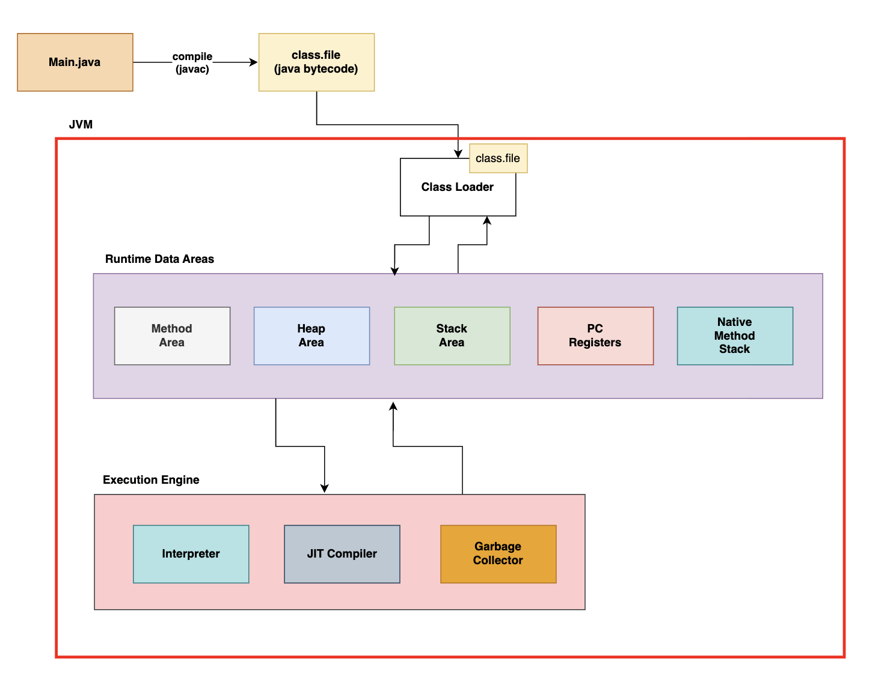

# 자바 실행 환경 - JDK, JRE, JVM 관계

## JDK (Java Development Kit)
* 자바 개발 키트의 약자로 자바로 애플리케이션을 개발하기 위해 여러 도구들을 가지고 있는 키트
    * 자바 프로그램을 `빌드` → `컴파일` → `실행`까지 할 수 있게 해줌
* **구성**
    * `javac`: 자바 컴파일러
    * `jdb` : 자바 디버거
    * `Jar` : 자바 아카이브 도구 (자바 애플리케이션 프로그램으로 개발된 소스 파일)
    * `JRE` : 자바 런타임 환경
    * `JVM` : 자바 가상 머신

 

## JRE (Java Runtime Environment)
* 자바 실행 환경의 약자로, 자바 프로그램을 실행하기 위한 최소한의 런타임 환경이다.
    * JVM + 자바 프로그램 실행에 필요한 라이브러리들이 포함된 환경

* **구성**
    * `자바 표준 라이브러리` : 
    
    * `JVM` : 자바 가상 머신

 

## JVM (Java Virtual Machine)

* 자바의 바이트 코드를 실행 시켜주는 가상 머신
* 운영체제에 상관 없이 자바 프로그램을 실행 시킬 수 있음 